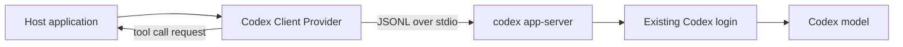

# Codex Client Provider

[](https://github.com/HJunLong601/codex-client-provider/actions/workflows/ci.yml)
[](https://pypi.org/project/codex-client-provider/)
[](LICENSE)

Reusable Python and LangChain adapter for the official `codex app-server`
protocol. It lets a local application use the Codex model access already managed
by the installed Codex client, without asking the user for an OpenAI API key.

The provider never reads, copies, logs, or stores Codex authentication files. It
starts `codex app-server`, communicates through JSONL over stdio, and leaves
authentication and account policy enforcement to the Codex client.

> This is an unofficial community project. Codex and OpenAI are trademarks of
> OpenAI. See the official [Codex App Server documentation](https://developers.openai.com/codex/app-server/)
> for the protocol and compatibility guidance.

## Features

- Persistent App Server process with request correlation and clean shutdown.
- LangChain `BaseChatModel` with sync and async invocation.
- Text, local image, and data URL image inputs.
- LangChain tool calls while keeping tool execution inside the host application.
- Structured output through Codex output schemas.
- Bounded image resizing and JPEG compression with temporary-file cleanup.
- Model, reasoning effort, timeout, client identity, and Codex binary overrides.
- Windows, macOS, and Linux support when the Codex CLI is available.



## Requirements

- Python 3.10 or newer.
- A compatible Codex CLI or Codex desktop installation.
- An active Codex login.

Verify the login before using the provider:

```console
codex login
codex login status
```

## Install

Install the current source checkout:

```console
python -m pip install .
```

After the first PyPI release, install it with:

```console
python -m pip install codex-client-provider
```

## Basic usage

```python
from codex_client_provider import CodexAppServerChatModel

model = CodexAppServerChatModel(
    model_name="default",
    reasoning_effort="low",
    timeout_seconds=120,
)
response = model.invoke("Return a concise status message.")
print(response.content)
```

The provider also supports LangChain tools:

```python
from langchain_core.tools import tool
from codex_client_provider import CodexAppServerChatModel


@tool
def lookup_temperature(city: str) -> str:
    """Return a sample temperature for a city."""
    return f"{city}: 23 C"


model = CodexAppServerChatModel().bind_tools([lookup_temperature])
message = model.invoke("What is the temperature in Shanghai?")
for call in message.tool_calls:
    result = lookup_temperature.invoke(call["args"])
    print(result)
```

The host application remains responsible for running tools. The provider only
asks Codex to return a LangChain-compatible tool call, which prevents the model
from silently using Codex built-in shell, browser, or file tools on the host's
behalf.

## Configuration

| Setting | Default | Purpose |
| --- | --- | --- |
| `CODEX_CLIENT_BIN` | Auto-detected | Absolute path to `codex` or `codex.exe`. |
| `CODEX_CLIENT_IMAGE_MAX_EDGE` | `1600` | Maximum image width or height in pixels. |
| `CODEX_CLIENT_IMAGE_MAX_BYTES` | `786432` | Target maximum encoded image size. |
| `CODEX_CLIENT_IMAGE_JPEG_QUALITY` | `82` | Initial JPEG quality for compressed images. |

The constructor accepts `model_name`, `reasoning_effort`, `timeout_seconds`,
`codex_binary`, and `service_name`. The provider uses the App Server's read-only
sandbox for model turns.

For compatibility with the original Artemis integration, the legacy
`ARTEMIS_CODEX_*` environment variable names are accepted when the corresponding
`CODEX_CLIENT_*` variable is absent.

## Development

```console
python -m pip install -e ".[dev]"
ruff check .
ruff format --check .
pyright
pytest
python -m build
twine check dist/*
```

Run the opt-in live smoke test only on a machine with a working Codex login:

```console
python scripts/smoke.py
```

See [CONTRIBUTING.md](CONTRIBUTING.md) for the release workflow and
[SECURITY.md](SECURITY.md) for the authentication boundary.
