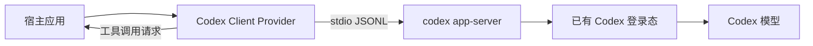

# Codex Client Provider

[English](README.md) | **简体中文**

[](https://github.com/HJunLong601/codex-client-provider/actions/workflows/ci.yml)
[](https://pypi.org/project/codex-client-provider/)
[](LICENSE)

面向官方 `codex app-server` 协议的可复用 Python 与 LangChain 适配器。它让本地应用
直接使用已安装 Codex 客户端管理的模型能力，无需让用户另外配置 OpenAI API Key。

Provider 不会读取、复制、记录或保存 Codex 认证文件。它负责启动
`codex app-server`，通过 stdio 上的 JSONL 与其通信；登录状态、账号策略和权限校验
仍由 Codex 客户端负责。

> 这是一个非官方社区项目。Codex 和 OpenAI 是 OpenAI 的商标。协议及兼容性信息
> 请参考官方 [Codex App Server 文档](https://developers.openai.com/codex/app-server/)。

## 功能

- 持久化复用 App Server 进程，支持请求关联和安全关闭。
- 提供 LangChain `BaseChatModel`，支持同步和异步调用。
- 支持文本、本地图片和 Data URL 图片输入。
- 支持 LangChain 工具调用，同时由宿主应用负责实际执行工具。
- 通过 Codex 输出 Schema 支持结构化输出。
- 自动限制图片尺寸、执行 JPEG 压缩并清理临时文件。
- 可配置模型、推理强度、超时、客户端身份和 Codex 可执行文件路径。
- Codex CLI 可用时支持 Windows、macOS 和 Linux。



## 环境要求

- Python 3.10 或更高版本。
- 兼容的 Codex CLI 或 Codex 桌面客户端。
- 有效的 Codex 登录状态。

使用 Provider 前先确认登录：

```console
codex login
codex login status
```

## 安装

从 PyPI 安装已发布版本：

```console
python -m pip install codex-client-provider
```

需要从源码开发时执行：

```console
python -m pip install -e ".[dev]"
```

## 基本用法

```python
from codex_client_provider import CodexAppServerChatModel

model = CodexAppServerChatModel(
    model_name="default",
    reasoning_effort="low",
    timeout_seconds=120,
)
response = model.invoke("用一句话确认 Provider 已正常工作。")
print(response.content)
```

Provider 同样支持 LangChain 工具：

```python
from langchain_core.tools import tool
from codex_client_provider import CodexAppServerChatModel


@tool
def lookup_temperature(city: str) -> str:
    """返回指定城市的示例温度。"""
    return f"{city}: 23 C"


model = CodexAppServerChatModel().bind_tools([lookup_temperature])
message = model.invoke("上海现在多少度？")
for call in message.tool_calls:
    result = lookup_temperature.invoke(call["args"])
    print(result)
```

宿主应用始终负责执行工具。Provider 只让 Codex 返回符合 LangChain 格式的工具调用，
从而避免模型绕过宿主，直接使用 Codex 内置的 Shell、浏览器或文件工具。

## 配置

| 配置项 | 默认值 | 用途 |
| --- | --- | --- |
| `CODEX_CLIENT_BIN` | 自动检测 | `codex` 或 `codex.exe` 的绝对路径。 |
| `CODEX_CLIENT_IMAGE_MAX_EDGE` | `1600` | 图片宽度或高度的最大像素数。 |
| `CODEX_CLIENT_IMAGE_MAX_BYTES` | `786432` | 编码后图片的目标最大字节数。 |
| `CODEX_CLIENT_IMAGE_JPEG_QUALITY` | `82` | 压缩图片时使用的初始 JPEG 质量。 |

构造函数支持 `model_name`、`reasoning_effort`、`timeout_seconds`、
`codex_binary` 和 `service_name`。模型轮次使用 App Server 的只读沙箱。

为兼容最初的 Artemis 集成，当对应的 `CODEX_CLIENT_*` 变量不存在时，Provider 仍接受
旧的 `ARTEMIS_CODEX_*` 环境变量名。

## 认证与安全边界

- 使用当前 ChatGPT/Codex 账号的登录态和使用额度，不消耗 OpenAI API 余额。
- Provider 不读取 `~/.codex/auth.json`，也不要求宿主传入 Token。
- `CODEX_CLIENT_BIN` 只应指向可信的 Codex 可执行文件。
- 宿主必须在执行 LangChain 工具前自行完成参数校验和授权。
- App Server 协议可能随 Codex 客户端升级；升级后应重新运行集成测试。

## 开发

```console
python -m pip install -e ".[dev]"
ruff check .
ruff format --check .
pyright
pytest
python -m build
twine check dist/*
```

真实冒烟测试只应在 Codex 已登录的机器上运行：

```console
python scripts/smoke.py
```

发布流程见 [CONTRIBUTING.md](CONTRIBUTING.md)，认证边界和漏洞报告方式见
[SECURITY.md](SECURITY.md)。
